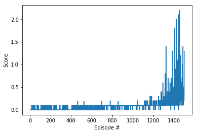

# Implementation Report

## Introduction

This document provides a brief explanation of this project. It describes the learning algorithm, Deep Deterministic Policy Gradient (DDPG), and the details of the neural networks architecture. Finally, it suggests some ideas to improve this project, that may be used in future works.

## Deep Deterministic Policy Gradient Algorithm

Deep Deterministic Policy Gradient (DDPG), as explained by [2], is a reinforcement learning technique that combines both Q-learning and Policy gradients. DDPG being an actor-critic technique consists of two models: Actor and Critic. The actor is a policy network that takes the state as input and outputs the exact action (continuous), instead of a probability distribution over actions. The critic is a Q-value network that takes in state and action as input and outputs the Q-value. DDPG is an “off”-policy method. DDPG is used in the continuous action setting and the “deterministic” in DDPG refers to the fact that the actor computes the action directly instead of a probability distribution over actions.

To improve the learning, this project added to the DDPG 3 techniques: **Soft Updates**, **Replay Buffer**, and **Gaussian Noise**. 

The first technique consists in creating a local and a target version for each model (actor and critic). The target models are updated by their local versions, in small portions. Then the local prediction is compared against target in order to reduce the variance. The main benefit of that is avoid abrupt changes on the network behavior.

Replay Buffer saves episodes steps in memory and later uses a sample of these steps to train the model, similar to a supervised learning algorithm. The Experience Replay used a memory size of 1,000,000 steps.

As DDPG trains as deterministic model, we also injected Gaussian noise into the actions selected by the policy to force exploration. The formula consists on:

$$x_{noise} = x + \theta (\mu - x) + \sigma Unif(a)$$

where
- $x$ is the original state value
- $x_{noise}$ is the state value with noise
- $\mu$ is 0
- $\theta$ is 0.15
- $\sigma$ is 0.1
- $Unif(a)$ returns an array of random numbers with the action size and following a Uniform Distribution.

## Neural Network Architecture

The Neural Networks were developed using **Pytorch** framework, and they are described as:

Actors:
- First layer: 16 nodes, according to the number of states of both rackets
- Second layer (hidden): 256 nodes
- Third layer (hidden): 128 nodes
- Last layer: 2 nodes, according to the number of actions

The hidden layers used ReLU and Tanh activation functions. I also applied Batch Normalization after each node.

Critic:
- First layer: 16 nodes, according to the number of states of both rackets
- Second layer (hidden): 256 nodes + 2 (actions)
- Third layer (hidden): 128 nodes
- Last layer: 1 node, to predict the Q-Value function.

The hidden layers used ReLU activation function. I also applied Batch Normalization after each node.

The optimizer used was **Adam**, at a Learning Rate of 0.0001.

The Reinforcement Learning **hyperparameters** are:

- Number of episodes: 5000
- Maximum number of time steps per episode: 1000
- Replay Buffer size: 1,000,000
- Batch Size: 128
- Discount Factor (GAMMA): 0.99
- Soft update rate for the target model (TAU): 0.0001
- Learning Rate (Actor and Critic): 0.0001
- L2 regularization weight decay: 0
- Stop criteria was a averaged sum of rewards above +0.5

## Results

The agent achieved the minimum score of +0.5 after 1500 episodes:

## Future Works

For the first time, I tried to use the Multi-Agent DDPG strategy (MADDPG), but the results were feeble. So I investigated in the Udacity forum how my colleagues were solving the problem. For my suprise, the single agent strategy was working for them [3]. In future works I'm planning to try MADDPG again.

## References

1. MORALES, M., **Grokking Deep Reinforcement Learning**, Simon and Schuster, 2020.

2. [Deep Deterministic Policy Gradient (DDPG): Theory and Implementation](https://towardsdatascience.com/deep-deterministic-policy-gradient-ddpg-theory-and-implementation-747a3010e82f), by Sunny Guha, accessed on Dec 9th, 2021.

3. https://knowledge.udacity.com/questions/518988